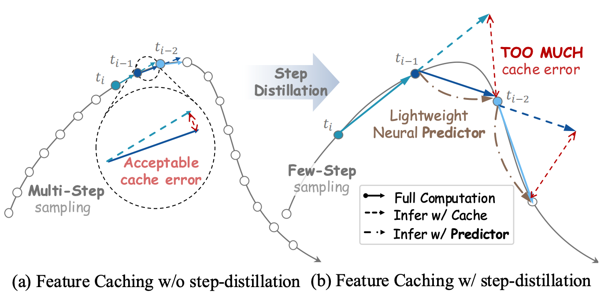
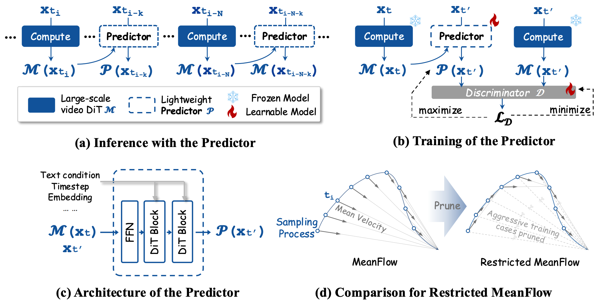

<div align=center>
  
# *DisCa*: Accelerating Video Diffusion Transformers with *Dis*tillation-Compatible Learnable Feature *Ca*ching
<h3>CVPR 2026</h3>

**[EPIC Lab@SAI,SJTU](http://zhanglinfeng.tech)** | **[Tencent Hunyuan](https://github.com/Tencent-Hunyuan)** 

[Chang Zou](https://shenyi-z.github.io/), 
[Changlin Li](https://scholar.google.com/citations?user=wOQjqCMAAAAJ&hl=en), 
Yang Li,
Patrol Li,
Jianbing Wu,
Xiao He,
Songtao Liu,
Zhao Zhong,
Kailin Huang,
[Linfeng Zhang](https://zhanglinfeng.tech)<sup>†</sup>

<a href="https://arxiv.org/abs/2602.05449" target="_blank"></a>
<a href="#citation"></a>
<a href="https://huggingface.co/Tencent/DisCa" target="_blank"></a>
</div>


## 📑 Overview

> **<p align="justify"> Abstract:** *While diffusion models have achieved great success in the field of video generation, this progress is accompanied by a rapidly escalating computational burden.
Among the existing acceleration methods, Feature Caching is popular due to its training-free property and considerable speedup performance,but it inevitably faces semantic and detail drop with further compression. Another widely adopted method, training-aware step-distillation, though successful in image generation, also faces drastic degradation in video generation with a few steps. Furthermore, the quality loss becomes more severe when simply applying training-free feature caching to the step-distilled models, due to the sparser sampling steps. 
This paper novelly introduces a **distillation-compatible learnable** feature caching mechanism for the first time. We employ **a lightweight learnable neural predictor** instead of traditional training-free heuristics for diffusion models, enabling a more accurate capture of the high-dimensional feature evolution process. Furthermore, we explore the challenges of highly compressed distillation on large-scale video models and propose a conservative **Restricted MeanFlow** approach to achieve more stable and lossless distillation. By undertaking these initiatives, we further push the acceleration boundaries while preserving generation quality.* </p>

## ✏️ Technical Details

> <p align="justify">(a) The inference procedure under the proposed Learnable Feature Caching framework. The lightweight Predictor P performs multi-step fast inference after a single computation pass through the large-scale DiT M. (b) The training process of Predictor. The cache, initialized by the DiT, is fed into the Predictor as part of the input. The outputs of the Predictor and DiT are passed to the discriminator D, alternating between the objectives of maximizing and minimizing $L_D$ as part of the adversarial game. (c) The lightweight Predictor with two DiT Blocks, typically constitutes less than 4% of the total size of the DiT, enabling high-speed and accurate inference. (d) The Restricted MeanFlow is constructed primarily by pruning the components with a high compression ratio in the original MeanFlow, thereby facilitating the learning of the local mean velocity. </p>

## 🧐 Visualizations

### [HunyuanVideo1.5-i2v] DisCa

<div align="center">
  <video src="https://github.com/user-attachments/assets/160aa932-2960-4b52-8213-a87454bd936a" width="100%"> </video>
</div>

<div align="center">
  <video src="https://github.com/user-attachments/assets/5ace9419-1cc7-4d02-9d1b-b7207b689ebc" width="100%"> </video>
</div>

### [HunyuanVideo1.0-t2v] Restricted MeanFlow

<div align="center">
  <video src="https://github.com/user-attachments/assets/fcd1717e-7b80-456c-ab24-214b28999085" width="100%"> </video>
</div>

## 🛠 Installation

``` bash
git clone https://github.com/Tencent-Hunyuan/DisCa.git
cd DisCa
```

## 🪐 Experiments

### Text-to-Video (T2V) Task on HunyuanVideo-1.0
The experiments for the Text-to-Video task are conducted on **HunyuanVideo-1.0**. Given that the original project does not provide inference scripts for MeanFlow, we have supplemented them in this project. 

We provide two scripts to implement the proposed methods:
* `infer_r_meanflow.sh` for **Restricted MeanFlow**
* `infer_disca.sh` for **DisCa**

The environment setup follows the official HunyuanVideo-1.0 configuration. We have enabled command-line argument passing; you can modify these arguments directly within the bash files or execute them via the command line.

### Image-to-Video (I2V) Task on HunyuanVideo-1.5
The experiments for the Image-to-Video task are conducted on **HunyuanVideo-1.5**. Because HunyuanVideo-1.5 is already well-adapted for MeanFlow inference, this project provides a lightweight and concise codebase. 

Since the Image-to-Video task inherently possesses stronger control signals and is easier to distill, coupled with the enhanced capabilities of HunyuanVideo-1.5, the I2V implementation in this project achieves a higher compression ratio.

**Getting Started:**
1. Follow the instructions in [`disca_i2v_hyvideo15/README.md`](disca_i2v_hyvideo15/README.md) to quickly set up the environment and configure the code.
2. Execute the inference directly using `infer_disca.sh`.

**Restricted MeanFlow Component:**
For the corresponding Restricted MeanFlow component, you can use the [HunyuanVideo-1.5-480P-I2V-step-distill](https://huggingface.co/tencent/HunyuanVideo-1.5/tree/main/transformer/480p_i2v_step_distilled) model provided in the official HunyuanVideo-1.5 repository. This model is distilled using similar techniques and has undergone further optimization.


## 📚 Citation

```bibtex
@inproceedings{zou2026disca,
  abbr      = {CVPR},
  title     = {DisCa: Accelerating Video Diffusion Transformers with Distillation-Compatible Learnable Feature Caching},
  author    = {Zou, Chang and Li, Changlin and Liu, Songtao and Zhong, Zhao and Huang, Kailin and Zhang, Linfeng},
  booktitle = {Proceedings of the IEEE/CVF Conference on Computer Vision and Pattern Recognition (CVPR)},
  year      = {2026},
  url       = {https://arxiv.org/abs/2602.05449},
  note      = {to appear},
}
```

## 🧐 Limitations
Despite achieving promising performance, DisCa still leaves significant room for optimization, particularly regarding issues like inter-frame jitter and the need for higher compression ratios. How can we train a better Predictor? It might be worth exploring more techniques (like DMD and post-training etc..) to further improve the performance.

## 🎉 Acknowledgements
Thanks to HunyuanVideo-1.0 and HunyuanVideo-1.5 for open-sourcing their code and models, which make this work possible.